# RadioESP32
RadioESP32 is a high-performance multimedia platform built on the ESP32 architecture. Originally starting as a dedicated standalone internet radio, the platform has evolved significantly. Starting with version 2.0.0, the project has been completely re-engineered into an advanced multi-boot system that transforms a single hardware device into an Internet Radio player, a local SD card audiobook player, and a high-fidelity Bluetooth loudspeaker – all managed by an independent recovery and deployment application.\
**Note:** Complete project documentation can be found in the [UserGuide_EN.pdf](doc/UserGuide_EN.pdf) file.

### Display and embedded web server preview
For illustration, you can see three photos of the display. You may be surprised to see that some of the text lines are blurred. The explanation is simple. This is scrolling text, because otherwise it wouldn't fit on the display!\
The first picture shows the radio playing, the second shows a file playing from an SD card, and the third shows the clock.

  
   
  

There's no need to describe the appearance of the web interface. You can learn much more from a few screenshots.

  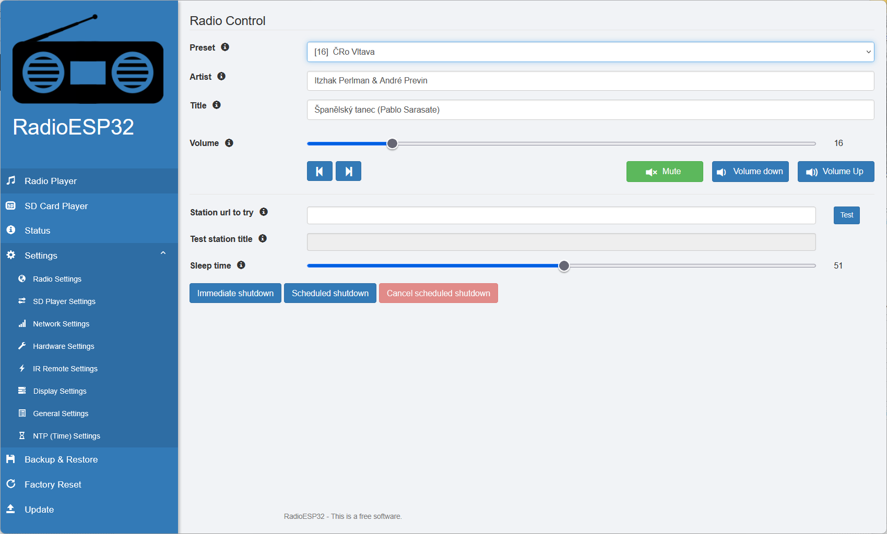

## Project Origin & Acknowledgments
This project would likely never have been created without the popular [ESP32Radio-V2](https://github.com/Edzelf/ESP32Radio-V2) project by [Edzelf](https://github.com/Edzelf). I am deeply grateful to the author for his outstanding work, which served as the original foundation for this software.

While I initially deployed the original project in its unchanged form, several limitations quickly became apparent. My primary motivation for rewriting and expanding the software stemmed from two major issues:

- **Localization:** The original display implementation did not support accented diacritics, which was critical for a proper local user experience.

- **Audiobook Playback:** One of my core requirements was the ability to listen to audiobooks from an SD card. Audiobooks require files to be played in a strict, defined alphabetical order. In the original software, copying files from a PC to an SD card resulted in them being indexed and played in a seemingly random order, making sequential listening highly complicated without constant manual track selection.

Additionally, I preferred a different default behavior. Instead of always resuming the last played station at the previous volume level upon power-up, I prefer the device to initialize to a pre-defined default station and default volume. I also planned to integrate entirely new hardware and software features, such as single-button power toggling and an automated sleep/turn-off timer.

Despite these changes, several core elements from Edzelf's project were retained, which significantly aided my early development. Furthermore, the web interface design, the communication method between the ESP32 and the browser, and the configuration file management system were adopted from the [esp-rfid](https://github.com/esprfid/esp-rfid) project - a highly reliable setup I have successfully utilized across multiple designs.

# Evolution in Version 2.0.0+
During development, I realized that with a purely software-driven approach, the existing hardware design could be utilized as a full-featured Bluetooth loudspeaker. To implement this comfortably, version 2.0.0 underwent a fundamental architectural overhaul.
To streamline production and focus on maximum stability, legacy sub-variants (such as designs without a display or designs storing web server assets directly inside a volatile file system partition) were abandoned. Moving forward, the project is maintained as a single production variant: always equipped with a display and always compiling web server assets directly into the program memory. This specific design is mandatory to support the automated multi-boot Update Manager system.

## Upgrading from Version 1.X.X
If you are upgrading an existing device from a 1.X.X release, your configuration file is fully compatible with the new version. However, due to the fundamental architectural changes mentioned above, a clean installation via cable is required:
- **Backup** your current configuration using the Backup & Restore menu in your existing web interface.
- Perform a **full installation** over a USB cable using the new Flash utility (flash.bat).
- **Restore** your configuration file using the Backup & Restore menu in the new version 2.0.0 interface.

**Note:** 
*Before proceeding with the upgrade, please verify that your hardware meets the new minimum requirements (8MB Flash and PSRAM), as legacy 4MB modules are no longer supported.*

## Legacy Differences: Radio Application vs. Edzelf's ESP32Radio
The following enhancements and modifications apply exclusively to the Internet Radio application (and its web configuration) compared to the original Edzelf implementation:

- **Strict Alphabetical Playback:** Fixed the random indexing issue on SD cards. Files and folders are sorted properly, enabling seamless audiobook listening. However, shuffle mode can be turned on as needed.

- **Diacritics & Extended Character Support:** The display engine was rewritten to support full native character mapping and custom fonts.

- **Predictable Initialization:** The device turns on to a user-defined default station and safe volume level rather than resuming the last state.

- **Single-Button Power Toggle:** Hardware-software integration allows turning the entire device completely on and off using the same single physical button.

- **Integrated Sleep Timer:** Supports a configurable sleep countdown that automatically powers down the hardware.

- **Comfortable Web-Based IR Learning:** Unlike the original project, adding or modifying infrared remote control commands is managed through an incredibly intuitive and automated web interface, allowing the device to capture and assign raw hardware codes on the fly.

# Full-Featured Bluetooth Loudspeaker Application
The Bluetooth Loudspeaker mode (running on OTA\_1) is engineered to deliver a premium commercial-grade user experience, offering deep visual feedback and control options rarely found in DIY audio systems.

## Key features include:
- **Identical Display Dashboard:** The physical display mirrors the rich visual interface of the Radio application, showing a real-time battery status indicator, an active volume bar, and a track progress bar.

- **Dynamic Status Icons:** Features clear visual indicators for Bluetooth connectivity (color-coded blue for active connection, grey for disconnected state) along with dedicated Play/Pause status indicators.

- **Rich Metadata & Auto-Scrolling:** Streams live metadata directly from the connected smartphone. Track titles, artist names, and album details are fully processed and rendered with native diacritic support, automatically triggering a smooth text-scrolling engine if the text length exceeds the screen boundaries.

- **Dual Physical Control Layers:** The loudspeaker can be controlled fully via the mechanical physical rotary encoder or completely hands-free using an Infrared Remote Control (handling Play, Pause, Track Skip, and Volume adjustments).

- **Centralized Configuration:** Because the Bluetooth application completely turns off the Wi-Fi stack to eliminate protocol overhead and interference, it does not host a web server. Instead, all Bluetooth-specific settings (including custom broadcast device naming and the advanced IR remote control command learning) are comfortably configured inside the unified web interface of the Internet Radio application.

# System Architecture & Multi-Boot Partitioning
Due to the strict hardware limitations of the ESP32 chip (specifically the high instability and memory constraints of running Wi-Fi and Bluetooth stacks simultaneously) the system separates core features into completely independent firmware binaries.

The system utilizes a custom partition layout designed for 8MB Flash chips. The minimum required hardware configuration is the ESP32-WROVER-E-N8R4 module. Volatile PSRAM memory is mandatory, as modern versions of the underlying audio libraries will not function without it.

## The memory layout divides the hardware into four distinct primary zones:
| Partition Type | Application Name | Core Functionality | Network State |
| - | - | - | - |
| **Factory** | Update Manager | Recovery, deployment, and binary flashing | Wi-Fi (Station with Internet) |
| **OTA\_0** | Internet Radio | Web-streaming, SD card media player | Wi-Fi (Station / Initial AP Setup) |
| **OTA\_1** | BT Loudspeaker | High-fidelity A2DP audio playback | Completely Disabled (No Wi-Fi) |
| **LittleFS** | Configuration | Shared system settings and profiles | Non-volatile storage |

All three applications share a single, unified configuration file stored in the LittleFS zone. Switching between applications triggers a low-level hardware reset using direct RTC controller registry manipulation, ensuring that the hardware cache and DMA controllers are completely cleared for a pure warm boot.

# Independent Update Manager
Because individual OTA application partitions contain completely different binary structures (Radio vs. Bluetooth), traditional OTA upgrades (where a new version is uploaded to an inactive slot and toggled) are impossible.

The project solves this by deploying a completely independent recovery application in the factory partition. When triggered via the display menu or the radio's web interface, the device reboots into the red-themed Update Manager web server (accessible via the credentials defined in the source code). From this dashboard, users can view live tables comparing current firmware versions against the latest versions available online, perform automated network updates, create full system binary backups, or deploy manual downgrades from local files.

  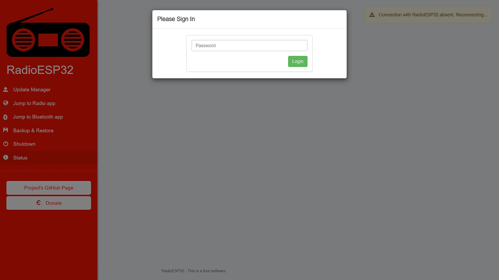

The Update Manager features critical system-level fail-safes. If the supply battery drops below a safe operational threshold during an update cycle, an asynchronous JavaScript modal hard-locks the entire web interface, preventing user interactions until safe power parameters are restored, eliminating the risk of accidental firmware bricking.

## Advanced Graphics Engineering
To achieve absolute long-term stability, the graphics pipeline was completely refactored. The Bluetooth application runs an aggressive real-time A2DP data sink. Under standard implementations, multi-core thread collisions frequently occur on the shared SPI display bus when high-priority Bluetooth background tasks on Core 0 interrupt the main application execution loop on Core 1.

The system eliminates these race conditions by removing traditional RTOS mutexes entirely. Instead, all graphic subsystems, status readouts, and display bars (such as the volume bar, battery indicator, progress bars, and scrolling metadata tracks) are completely centralized under a single-task, asynchronous flag-driven pipeline in the display loop. Asynchronous events from Bluetooth callbacks merely flag status variables in RAM, which are safely ingested and drawn by a single dedicated display task.

# Development and Build Flags
The project is developed in VS Code using the PlatformIO IDE paired with the Pioarduino extension. Using environment build flags in `platformio.ini`, the firmware behavior is customized using the following core definitions:

- **DATAWEB=true/false:** Setting this flag to `true` compiles a development variant where web server assets are loaded dynamically from the LittleFS partition, allowing real-time, browser-based source editing via the integrated online [Ace editor](https://ace.c9.io/). Setting this to `false` creates the production variant, compressing and injecting all HTML and JS assets directly into the program memory (PROGMEM) as static variables. This is the mandatory format for deployment binaries.

- **SDCARD:** Compiles full support for the local SD card hardware and alphabetical media player engine.

- **BATTERY:** Enables power monitoring, enabling precise voltage calibration routines and rendering live battery status bars across both the physical display and web dashboards.

- **AUTOSHUTDOWN:** Compiles the control logic for the single-button soft power toggle circuit and the automatic sleep timer.

# Third-Party Libraries & Acknowledgments
This project relies heavily on the open-source community. I would like to express my sincere gratitude to the authors of the following exceptional libraries, whose hard work made this multi-boot platform possible:

- **[ESP32-audioI2S](https://github.com/schreibfaul1/ESP32-audioI2S) by schreibfaul1** – The core engine powering the high-performance internet radio streaming and SD card media playback.

- **[ESP32-A2DP](https://github.com/pschatzmann/ESP32-A2DP) by pschatzmann** – The backbone of the Bluetooth application, providing a reliable and robust real-time A2DP audio sink.

- **[ESPAsyncWebServer](https://github.com/ESP32Async/ESPAsyncWebServer)** – Essential for driving the asynchronous, responsive web interfaces across the platform slots.

- **[ArduinoJson](https://github.com/bblanchon/ArduinoJson) by bblanchon** – Used for fast, memory-efficient parsing of configuration files and the update manager tables.

- **[base64](https://github.com/Densaugeo/base64_arduino) by Densaugeo** – Utilized for secure encoding and handling of system assets and network communication data.

- **[Arduino-IRremote](https://github.com/Arduino-IRremote/Arduino-IRremote)** – Powering the automated infrared remote control receiver and code-learning capabilities.

- **[TFT\_eSPI](https://github.com/Bodmer/TFT_espi) by Bodmer** – The highly optimized graphics driver used to render sprites and smooth scrolling text on the SPI display.

- **[U8g2](https://github.com/olikraus/u8g2) by olikraus** & **[U8g2\_for\_TFT\_eSPI](https://github.com/Bodmer/U8g2_for_TFT_eSPI) by Bodmer** – Providing the comprehensive font support required for native localization, accented diacritics, and system icons.

## PlatformIO Environment & Custom Python Targets
The project utilizes advanced customization features of PlatformIO with the Pioarduino extension to automate the compilation, transformation, and deployment of firmware slots. Since standard environment filters naturally restrict automated serial flashing to the `OTA_0` partition, a dedicated set of specialized automation scripts was engineered to streamline the development workflow:

- **`app_deploy.py` (Binary Archiving):** Executed automatically post-build. It automatically moves and renames compiled images into the structured `/bin/<env>/` directory, preparing them for deployment.

- **`custom_targets.py` (Advanced Workflow Automation):** Exposes core system functions accessible comfortably directly via the *Pioarduino: Project Tasks / \<env\> / Custom* IDE side menu. It processes two critical automated workflows:

  - **Download FS & Create WEBH:** Automates the complete transformation of production web assets. It downloads the live file system image from the hardware using maxgerhardt's downloader utility, extracts the HTML and JS assets from `LittleFS`, and translates them directly into compressed C++ array data variables ready for `PROGMEM` generation.

  - **Upload custom binary:** The primary development flashing mechanism. Instead of pushing blindly to `OTA_0`, this target programmatically parses the local partition configuration table, dynamically locates the precise memory address boundaries for the active target environment, and executes a targeted wired upload directly to the correct slot (`OTA_1` for Bluetooth loudspeaker or `factory` for the Update Manager).

## Production Flash Utilities
For initial provisioning, assembly, and bulk deployment outside the VS Code IDE development sandbox, a dedicated, standalone host script named Flash Utilities is used.

  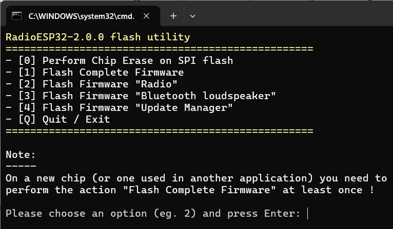

This standalone batch utility operates strictly as a master installation tool tailored for two main deployment scenarios:

1. **Full Environment Initialization:** Performs the first-time wired flashing of a fresh, raw ESP32 chip. It writes the global bootloader configurations, custom multi-boot partition boundaries, the initial `LittleFS` shared configuration image, and all three application binaries concurrently.

2. **Targeted Service Upgrades:** Provides a safe serial bypass tool to manually write or restore a single specific slot over a wired serial connection. This is the mandatory path required for initial installation or forced rewrites of the factory recovery application partition without formatting or impacting user profiles.

On a fresh device provisioning cycle, the system triggers a default fallback standalone Wi-Fi Access Point named **RadioESP32**. Navigating a web browser to `192.168.4.1` loads the initial onboarding setup screen to connect the multi-boot hardware platform to local wireless station configurations.

# Hardware Design & Component Selection
The physical hardware architecture is designed using the free/personal-use tier of Autodesk Eagle, utilizing a dual-stage isolation approach to completely eliminate ground loops, digital switching noise, and interference.

### Wiring diagram
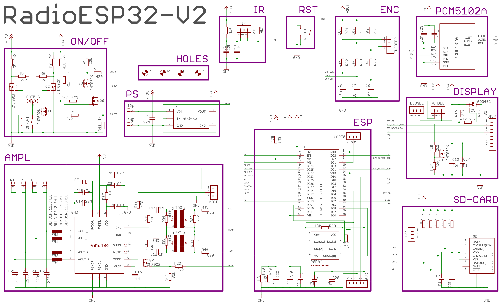

### Printed circuit board

  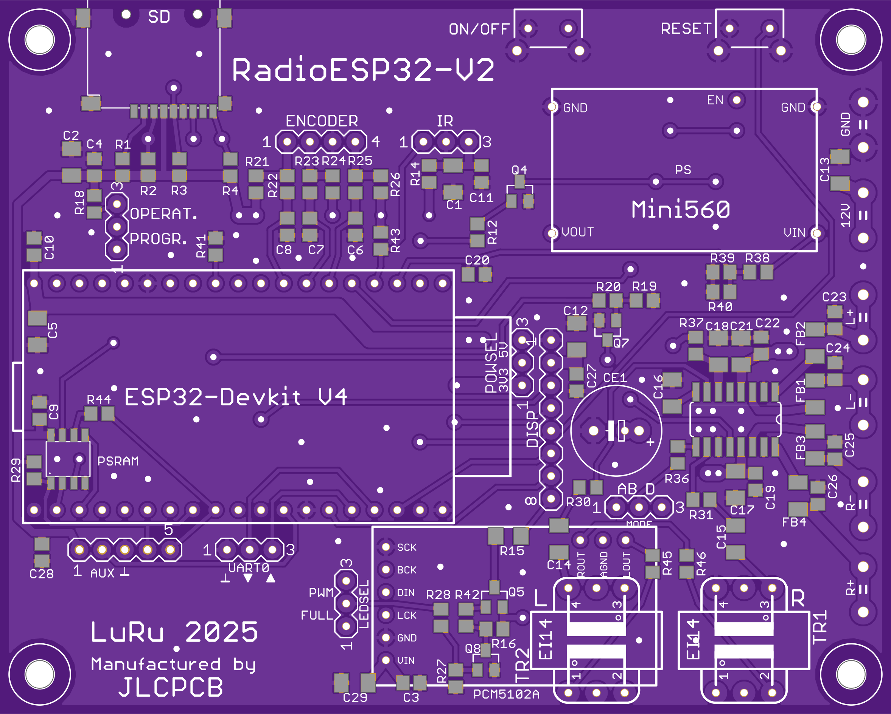
  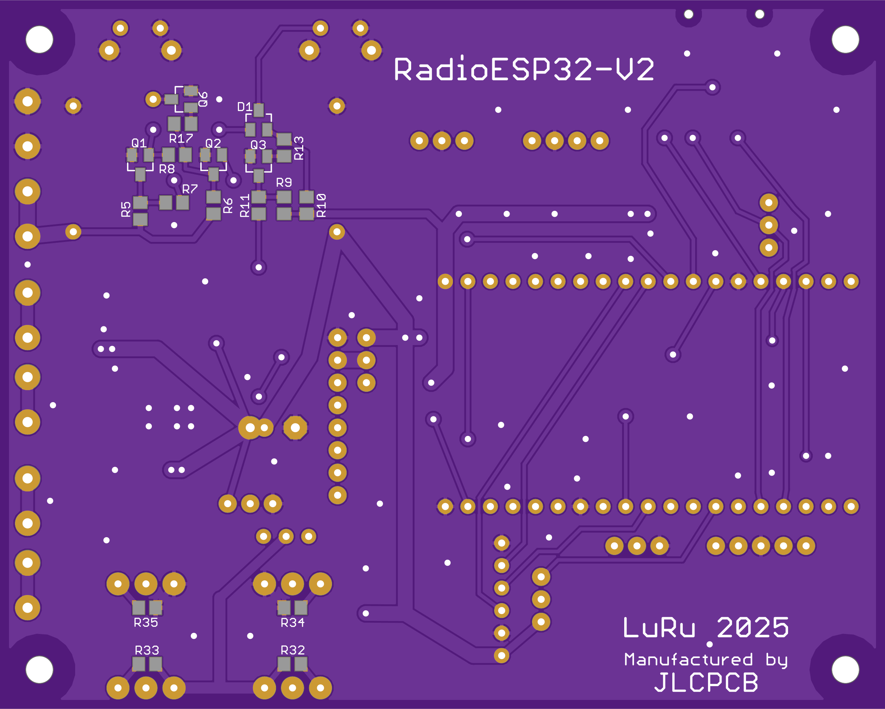 

### Choice of components
In the first phase of development, I used the VS1053 module (as a DAC) following Edzelf's example. It worked well, but I found this solution unnecessarily expensive and quite problematic (for example, I once accidentally bought a VS1003 instead and it didn't work well). That's why I completely abandoned this path and switched exclusively to a solution with I2S.
- **Main Processor:** ESP32-WROVER-E module (Silicon Revision 3 or higher, minimum 8MB Flash and 4MB PSRAM).

  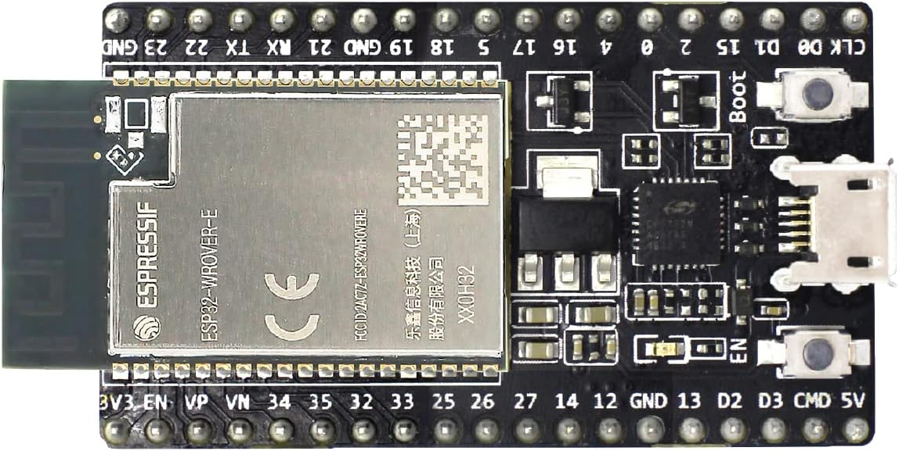
  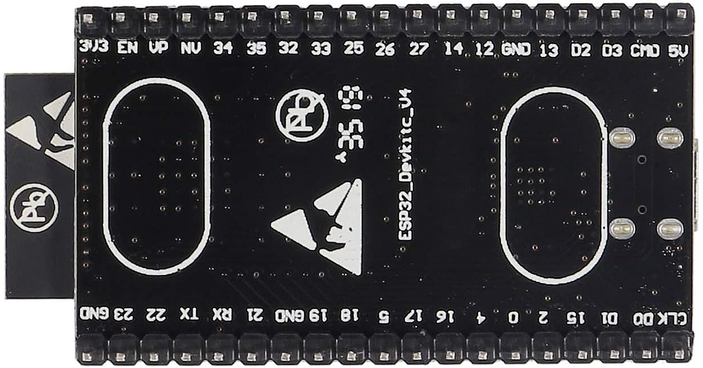 

- **Power Supply:** 12V primary input, optimized to run efficiently from three series-connected 18650 Li-ion cells or a standard wall adapter. A high-efficiency Mini560 step-down module regulates this down to a stable 5V rail. The module's EN (Enable) pin is directly wired into the single-button latching circuit for hard physical power management.

  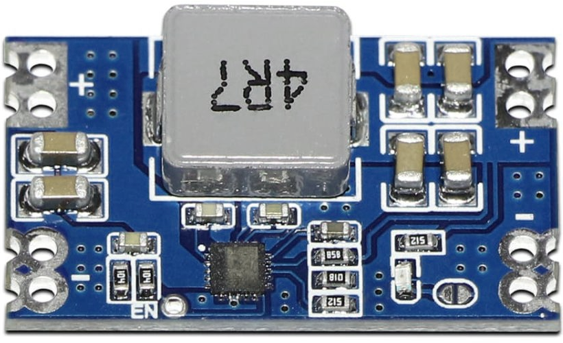
  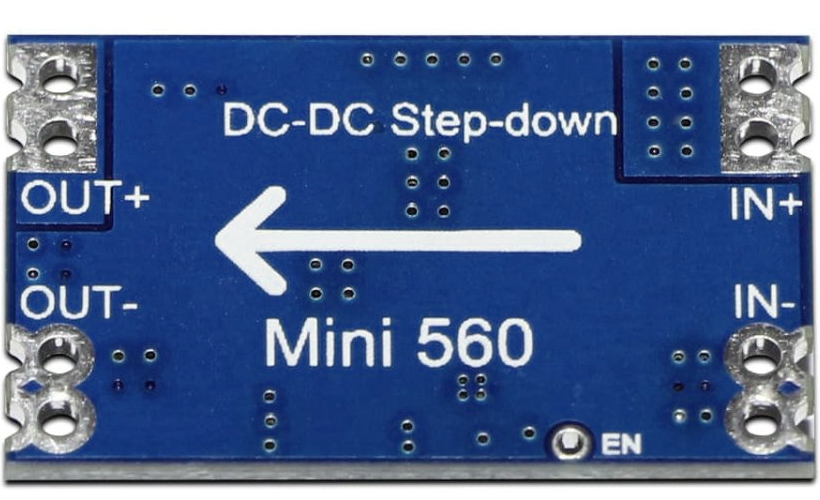 

- **Audio DAC:** PCM5102A I2S module, selected for its high dynamic range and integrated analog out pin liars, eliminating complex internal chassis cabling.

  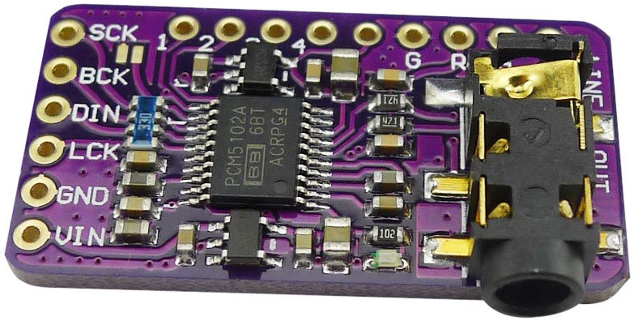
  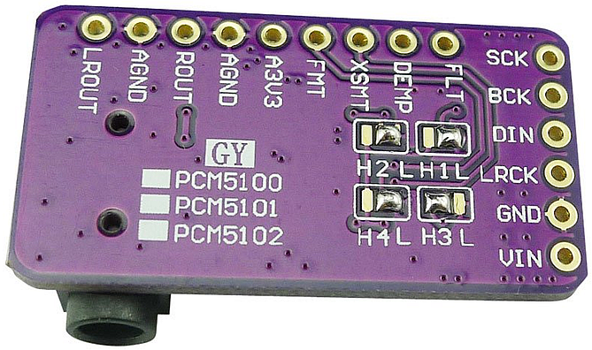 

- **Ground Loop Isolation:** Two low-profile 9.1mm audio isolation transformers are placed inline directly between the DAC outputs and the amplifier inputs, successfully blocking digital hum and cross-talk.

  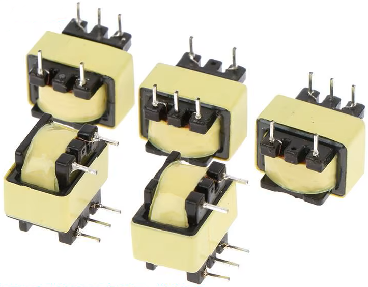
  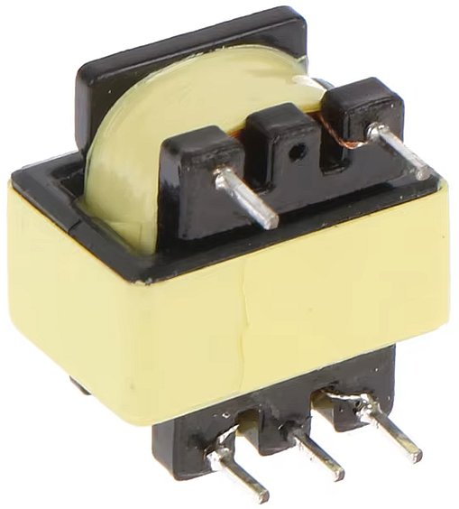 

- **Amplifier Stage:** PAM8406 5V stereo amplifier IC. This specific chip was chosen because it can operate in either Class-D (high efficiency for battery operation) or Class-AB (low RF noise for clean radio reception). The operating mode is manually selected on the PCB via hardware jumpers.

    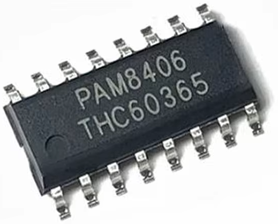

- **Display Interface:** 1.77-inch SPI TFT panel (160x128 resolution) driven natively by the optimized TFT\_eSPI library.

  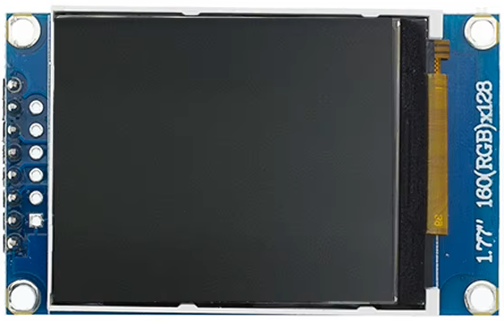
  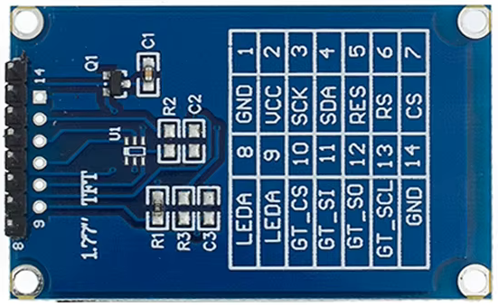 

- **User Control:** A robust EC11 mechanical rotary encoder with an integrated push-button handles physical navigation, complemented by a VS1838B infrared receiver supporting automatic remote control code learning.

  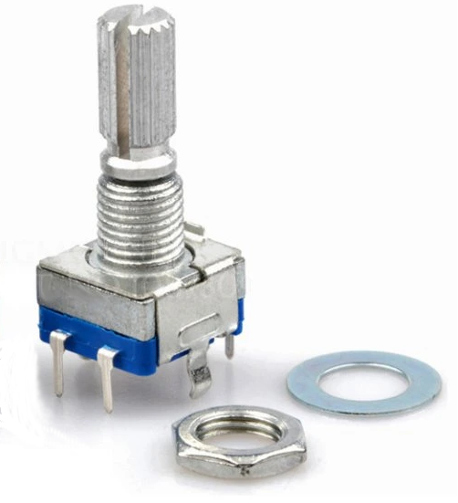
  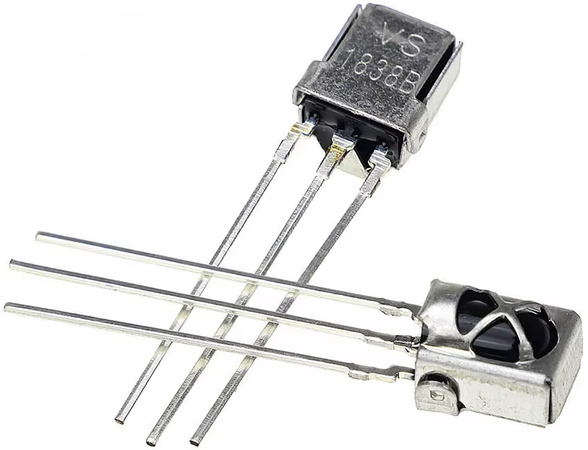 

- **Chassis Connections:** Traditional screw terminals were replaced with high-reliability 4.8mm male Faston terminals soldered directly to the PCB for all primary power inputs and speaker outputs, ensuring vibrating-proof connections inside the speaker enclosure.

  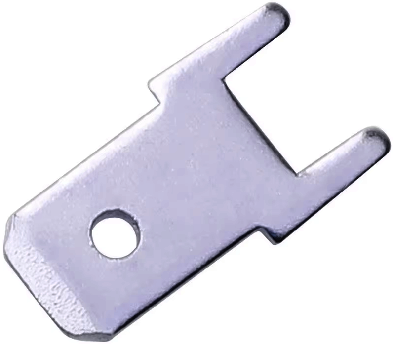 

## Assembled board
Finally, you can see a few pictures of the printed circuit board completely assembled and including the installed subboards (ESP32 development kit and DAC). I also added one photo of the finished radio (powered by three 18650 Li-ion cells).

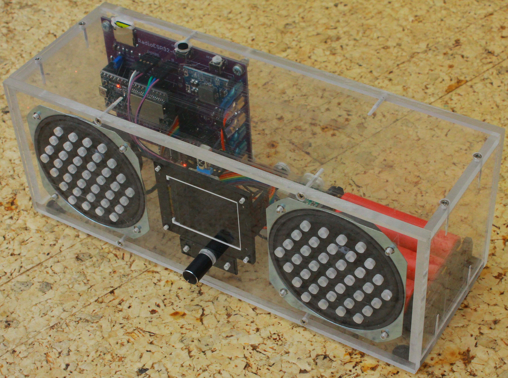

### License
The code parts written by the author of the **RadioESP32** project are licensed under [GPL-3.0](LICENSE), 3rd party libraries that are used by this project are licensed under different license schemes, please check them out as well.

