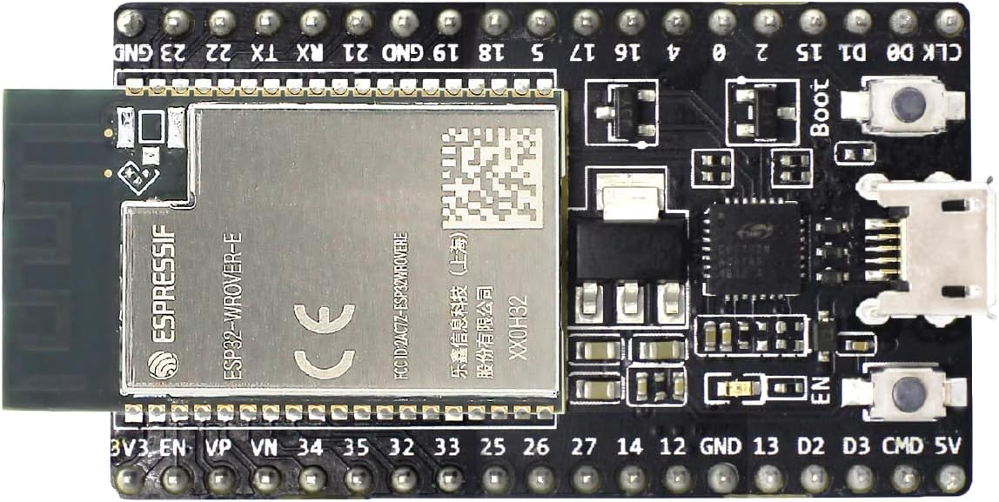
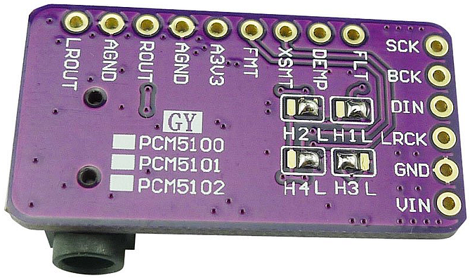

# RadioESP32
## Introduction
&nbsp;&nbsp;&nbsp;&nbsp;First of all, it is worth mentioning that this project would probably never have been created without the popular project [ESP32Radio-V2](https://github.com/Edzelf/ESP32Radio-V2) by [Edzelf](https://github.com/Edzelf). I am very grateful to the author for it and thank him for his work. Originally, of course, I took over the original project in its unchanged form, but very soon it stopped being convenient for me. I especially disliked the fact that the display did not display characters with diacritics.\
&nbsp;&nbsp;&nbsp;&nbsp;The second biggest problem for me was the functioning of the file player from the SD card. One of my requirements for the device was that it should allow listening to audiobooks. In this case, however, the files need to be played in a defined (i.e. alphabetical) order. But that did not work with the original SW. After copying the files from the HDD to the SD card, the files were always arranged in a kind of random order and listening to the individual parts in the correct order was very complicated (the correct part had to be selected manually).\
&nbsp;&nbsp;&nbsp;&nbsp;In addition to the two problems mentioned above, there were a number of other small things that I imagined to work differently. For example, I can mention a function that ensured that the last station listened to was always played after switching on (and with the last volume level used). But that did not suit me at all, I prefer that a default station (with the default volume) be played after switching on the device. I also planned to add some new functions that the original design did not have. In particular, I wanted the radio to be able to be turned on and off by pressing one (same) button and for the radio to have a sleep function (i.e. automatic shutdown after a set time).\
&nbsp;&nbsp;&nbsp;&nbsp;Despite the above facts, I took over several things from the original [ESP32Radio-V2](https://github.com/Edzelf/ESP32Radio-V2) project almost unchanged and my work was thus made easier.\
&nbsp;&nbsp;&nbsp;&nbsp;The website design, the way the ESP32 communicates with the computer (via a web browser), and a few other solutions (like how to upgrade or work with the configuration file) are taken from the [esp-rfid](https://github.com/esprfid/esp-rfid) project. I have used it in several projects and it exactly suits my needs and ideas.\
&nbsp;&nbsp;&nbsp;&nbsp;Complete project documentation can be found in the [UserGuide_EN.pdf](doc/UserGuide_EN.pdf) file.

For illustration, you can see three photos of the display. You may be surprised to see that some of the text lines are blurred. The explanation is simple. This is scrolling text, because otherwise it wouldn't fit on the display!\
The first picture shows the radio playing, the second shows a file playing from an SD card, and the third shows the clock.

  
   
  

## Development with VS Code and PlatformIO
&nbsp;&nbsp;&nbsp;&nbsp;I use VS Code/PlatformIO as a development environment. Using the *platformio.ini* file, it is possible to create several software variants by specifying or not specifying the so-called "build-flag". The **DATAWEB**, **SDCARD**, **BATTERY**, **AUTOSHUTDOWN** and **OTA** build-flags are particularly important.\
&nbsp;&nbsp;&nbsp;&nbsp;● Using the **DATAWEB** build-flag, the SW is compiled in a version that has the web server files stored in the "LittleFS" file system area, while without the **DATAWEB** parameter, the SW is compiled in a version in which the web server files are stored in the program memory (using the PROGMEM attribute) in the form of variables. I call the first version <ins>data</ins> for short, the second <ins>webh</ins>. The <ins>data</ins> variant is intended primarily for the development phase (but nothing prevents it from being used as a production one), while the <ins>webh</ins> variant is intended exclusively as a production one and it is more or less impossible to develop with it.\
&nbsp;&nbsp;&nbsp;&nbsp;● Using the **SDCARD** build-flag, support for the SD card file player function is enabled. Without using the aforementioned build-flag, the device is only able to play radio stations.\
&nbsp;&nbsp;&nbsp;&nbsp;● Using the **BATTERY** build-flag, support for the supply voltage measurement function is enabled. This is of course suitable in the case of battery power. The display then shows the charge level.\
&nbsp;&nbsp;&nbsp;&nbsp;● Using the **AUTOSHUTDOWN** build-flag, the support of the function that allows the device to be turned on and off with one button and also the sleep function (adjustable automatic shutdown time) is enabled. Of course, the condition is that the HW is equipped with the necessary circuit.\
&nbsp;&nbsp;&nbsp;&nbsp;● Using the **OTA** build-flag, the function that allows a comfortable upgrade from the web interface is enabled. See the Upgrade chapter.\
4 types of “envs” are also prepared in the *platformio.ini* file. With them, you can select both the development kit variant (4 or 8 MB) and the SW variant with or without a display. So, 4 combinations in total (**noota4mb**, **wota8mb**, **noota4mbnod** and **wota8mbnod**). The relevant “env” version is selected by commenting/uncommenting in the [platformio] section.

### Using the DATAWEB build-flag, I proceed as follows when developing the SW:
1) Development takes place exclusively in the software <ins>data</ins> variant (the DATAWEB build-flag is used in the *platformio.ini* file). After editing the source files, compilation is performed in the usual way and the device is upgraded via the USB (serial) port.
2) If it is necessary to edit the *.html or *.js files of the web server to fix or add a function, you need to open the page **http://IP_address_of_the_device/edit**. For this to work, the PC must be connected to the Internet. The online library "ace" (**A**jax.org **C**loud9 **E**ditor) is used for editing. For more information, see **https://ace.c9.io/**.
3) Once the required functionality has been achieved using steps 1 and 2, the <ins>webh</ins> variant of the software can be created. This is done by running the user script **Download FS & Create WEBH**, which is available via the **PROJECT TASKS/selected_env_version/Custom** menu. This will transform the web server files (from the LittleFS file system) into <ins>webh</ins> files. The utility "pio-esp32-esp8266-filesystem-downloader" by maxgerhardt is used to download the file system image and extract it.
4) Switch to <ins>webh</ins> variant (in the *platformio.ini* file, the build-flag DATAWEB needs to be removed [commented out]) and compile. The resulting image *firmware_WEBH_XXX.bin* (created during the compilation process) can be found in the **/bin/selected_env_version** directory. The version designation *XXX* is also set as a “build-flag” in the *platformio.ini* file before compilation.

## First start
When the device is started for the first time, it runs in default settings and in AP mode. On the PC, connect to the **RadioESP32** network and in the browser to the address **192.168.4.1**. A web page should appear through which the device settings need to be made.

## Design of the device
The circuit diagram and printed circuit board were created using the Eagle design system.
### Wiring diagram

### Printed circuit board

  
   

## Choice of components
In the first phase of development, I used the VS1053 module (as a DAC) following Edzelf's example. It worked well, but I found this solution unnecessarily expensive and quite problematic (for example, I once accidentally bought a VS1003 instead and it didn't work well). That's why I completely abandoned this path and switched exclusively to a solution with I2S. As the basis for the SW, I chose the excellent [ESP32‑audioI2S](https://github.com/schreibfaul1/ESP32-audioI2S) library from the author [shreibfaul1](https://github.com/schreibfaul1). This led to the need to use a type of ESP32 development kit that is equipped with PSRAM memory. Without this memory, no more complex project can be created with the library, and you will soon run into a lack of RAM. For this reason, I chose a WROVER development kit. It should also be noted right at the beginning that the chip revision must be at least **Rev 3**. I found that older revisions do not work well. I also recommend using the module version with 8MB memory. Regular versions with 4MB memory can also be used, but this means that the possibility of a convenient upgrade from the web environment is lost. This has already been explained in more detail in the previous text.\
<ins>Note:</ins> The printed circuit board also includes the possibility of using external PSRAM memory, but this is not installed when using the WROVER kit, it is already present on the mentioned kit.

  
   

I decided that the basic supply voltage of the device will be 12V, because it can be very well implemented with three 18650 Lion cells. However, the ESP32 development kit requires a voltage of 5V (as well as some other components) and therefore it is necessary to use a suitable step-down module. I chose the **Mini560** module, which is sufficiently dimensioned (both voltage and current) and is equipped with an EN input (necessary for my needs).

  
   

Originally (like Edzelf) I kept the option to choose between OLED and TFT display when compiling the software. But I finally gave up and OLED displays are no longer supported at all. So there are only two options - either a TFT display or none. I used a display with a diagonal of 1.77 inches and a resolution of 160x128. However, it should not be a problem to use any other one, supported by the TFT_eSPI library.

  
   

The essential part of the device is the digital to analog (DAC) converter. I chose a module with the PCM5102A chip, which suited me due to its dimensions and also because the audio output is not only connected to a jack connector, but also to a pin header. This greatly simplifies the connection of the converter to the motherboard.

  
   

As an amplifier, I chose the PAM8406 type, which is powerful enough, works with a 5V supply voltage, and can be easily soldered by hand. This amplifier has one more advantage - it can operate in either class D or AB. I have kept the option of choosing on the printed circuit board as well - the mode is selected by placing the jumper.

    

It is necessary to include isolation transformers between the DAC and the amplifier to break the ground loop and prevent unpleasant interference. I chose transformers that are only 9.1mm high and fit well between the converter board and the motherboard.

  
   

An important part of the device is also a rotary encoder. I used a completely common and cheap type EC11.\
An obvious requirement for the device's function was also the possibility of control via infrared control. I tried the VS1838B type as a receiver and it worked well.\
Finally, it was necessary to solve the method of connecting the supply voltage and speakers to the motherboard. I wanted to avoid terminal blocks with screws and therefore I chose faston connectors with a width of 4.8mm.

  
   
   

## Assembled board
Finally, you can see a few pictures of the printed circuit board completely assembled and including the installed subboards (ESP32 development kit and DAC).

### License
The code parts written by the author of the **RadioESP32** project are licensed under [GPL-3.0](LICENSE), 3rd party libraries that are used by this project are licensed under different license schemes, please check them out as well.

